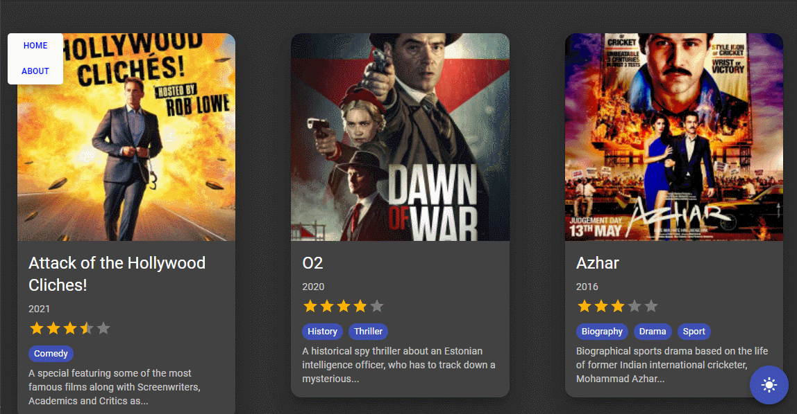

# 👨‍💻 웹 컨텐츠 프로그래밍 ( React ) [ 이연권 201730219 ]

2021년도 2학기 웹 컨텐츠 프로그래밍

<br />

## 📁 강의 기록

[Vuepress로 보기](https://dalcon10028.github.io/movie_app_2021/review-note/)

<br />

| -     | 제목                                                                                                                    | 날짜       | Vuepress                                                                                           |
| ----- | ----------------------------------------------------------------------------------------------------------------------- | ---------- | -------------------------------------------------------------------------------------------------- |
| 1주차 | [OT](https://github.com/dalcon10028/movie_app_2021/tree/master/docs/src/review-note/2021-09-01)                         | 2021-09-01 | [OT](https://dalcon10028.github.io/movie_app_2021/review-note/2021-09-01/)                         |
| 2주차 | [리액트 기초개념](https://github.com/dalcon10028/movie_app_2021/tree/master/docs/src/review-note/2021-09-08)            | 2021-09-08 | [리액트 기초개념](https://dalcon10028.github.io/movie_app_2021/review-note/2021-09-08/)            |
| 3주차 | [컴포넌트간 데이터 전달하기](https://github.com/dalcon10028/movie_app_2021/tree/master/docs/src/review-note/2021-09-15) | 2021-09-15 | [컴포넌트간 데이터 전달하기](https://dalcon10028.github.io/movie_app_2021/review-note/2021-09-15/) |
| 4주차 | [prop-types 도입하기](https://github.com/dalcon10028/movie_app_2021/tree/master/docs/src/review-note/2021-09-29) | 2021-09-29 | [prop-types 도입하기](https://dalcon10028.github.io/movie_app_2021/review-note/2021-09-29/) |


<br />

## 🎥 클론 코딩 영화 평점 웹서비스

<br />
<div align="center">
    
    
    
    
    
</div>

<br />

<p align="middle">
    
</p>

<h2 align="middle">
    <a href="https://movie-app-yeon.netlify.app/">🖥️ DEMO</a>
</h2>

### 시작하기

```bash
npm i # 의존성 설치
npm start # development mode로 시작
```

### 테스트

```bash
npm run test # watch mode로 테스트 실행
```

### 빌드

```bash
npm run build # build폴더로 빌드된 파일 생성
```
