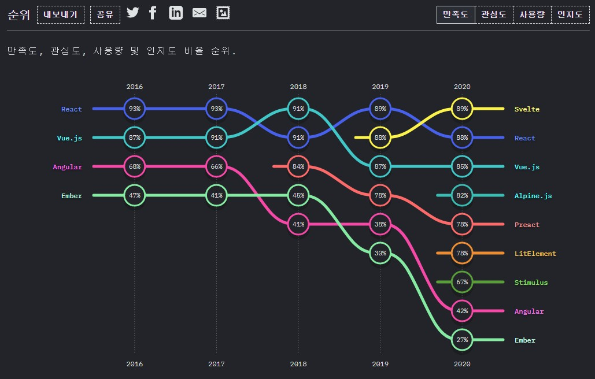

# 2021년 9월 1일 ( 1주차 )

## OT

::: tip
[깃허브에서 보기](https://github.com/dalcon10028/web-contents-programming/tree/master/docs/src/review-note/2021-09-01)
:::

## 강의 운영 및 평가 계획

- 3주차부터 원격, 대면 병행
- 8주차 중간고사, 15주차 기말고사
- 수행평가는 매주 학습한 내용의 GitHub 업로드 상황
- 출석 20, 수행 20, 중간 30, 기말 30

## 교재

  

<h3 align="center">Do it! 클론 코딩 영화 평점 웹서비스</h3>

## Chocolatey

MS에서 출시된 패키지 관리자이다.

[https://chocolatey.org/](https://chocolatey.org/)

## React Developer Tools

방문한 사이트가 리액트로 작성된 사이트인지 알 수 있고 디버깅 할 때 유용한 정보를 알 수 있다. (컴포넌트 구조, 등)

[https://chrome.google.com/webstore/detail/react-developer-tools/fmkadmapgofadopljbjfkapdkoienihi?hl=ko](https://chrome.google.com/webstore/detail/react-developer-tools/fmkadmapgofadopljbjfkapdkoienihi?hl=ko)

## State of JS

자바스크립트 생태계의 관련된 통계를 볼 수 있는 사이트이다.

[https://2020.stateofjs.com/ko-KR/technologies/front-end-frameworks/
](https://2020.stateofjs.com/ko-KR/technologies/front-end-frameworks/)

## Create React App

react를 프로젝트를 위한 보일러 플레이트

[https://github.com/facebook/create-react-app](https://github.com/facebook/create-react-app)
